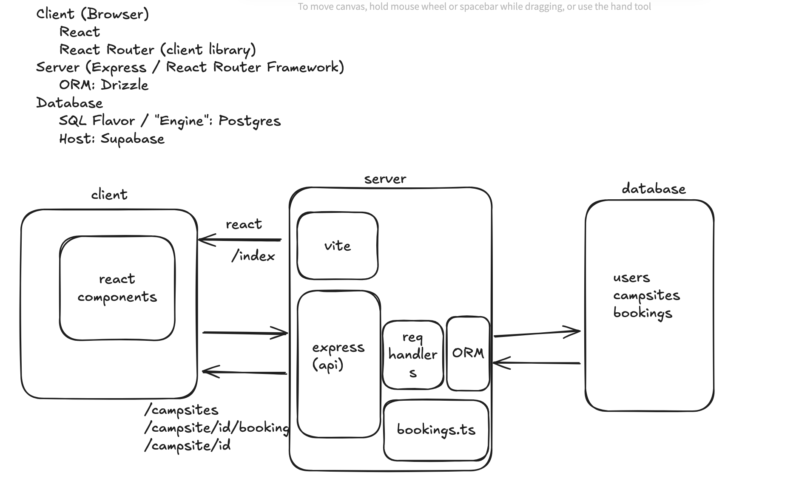

# Assignment

Design a reservation system for a campground.  

### Minimal Features
- ability to see campsite availability  
- ability to book a campsite  
- admin can add/remove campsites  

---

## 1. Core User Flows

### See Campsite Availability
- user visits the home page  
- sees a list of campsites  
- clicks a single campsite  
- sees details + calendar view of bookings for the next 2 months  

### Book a Campsite
- from the campsite details view, user selects start/end dates for available times on the calendar  
- navigates to checkout page with booking details and confirmation  
- clicks **confirm/pay** — authenticated with **BetterAuth**  
- booking is validated, confirmed, and added to the database  

### Admin Adds/Removes Campsites
- admin has a special login/role  
- authenticate the user with **BetterAuth** and check `isAdmin` flag  
- admin dashboard lists all campsites with **add/remove** buttons  

---

## 2. Data Models

### Campsite
- **id:** `uuid`  
- **name:** `string`  
- **description:** `string` (amenities, size, location, etc.)

### Booking
- **id:** `uuid`  
- **bookingDate:** `date`  
- **startDate:** `date`  
- **endDate:** `date`  
- **userId:** `uuid`  
- **campsiteId:** `uuid`  

### User (Admin?)
- **id:** `uuid`  
- **email:** `string`  
- **name:** `string`  
- **isAdmin:** `boolean`

---

### Example Queries

**When is this campsite booked?**  
```sql
SELECT * 
FROM booking 
WHERE campsite_id = {} 
  AND startDate > 2monthsAgo 
  AND startDate < 2monthsFromNow;
```
→ returns `Booking[]` → rendered in React component  

**What are my bookings?**  
```sql
SELECT * 
FROM booking 
WHERE user_id = {} 
  AND startDate > now;
```

**What are all the campsites?**  
```sql
SELECT * FROM campsite;
```

**Create a booking:**  
```sql
UPDATE booking 
SET startDate = ..., endDate = ..., userId = ..., campsiteId = ...;
```

---

## 3. Architecture Diagram



---

## 4. API Sketch

### `GET /campsites`
- **Inputs:** none  
- **Outputs:** `Campsite[]`

### `GET /campsite/{id}`
- **Inputs:** `id`  
- **Outputs:** `{ campsite: Campsite, bookings: Booking[] }`

### `POST /campsite/{id}/booking`
- **Inputs (body):** `Booking`  
- **Outputs:** `Booking | Error`

### `POST /campsite/create`
- **Inputs:** `Campsite`  
- **Outputs:** `Campsite`

### `POST /campsite/{id}/delete`
- **Inputs:** `id`  
- **Outputs:** success/failure message